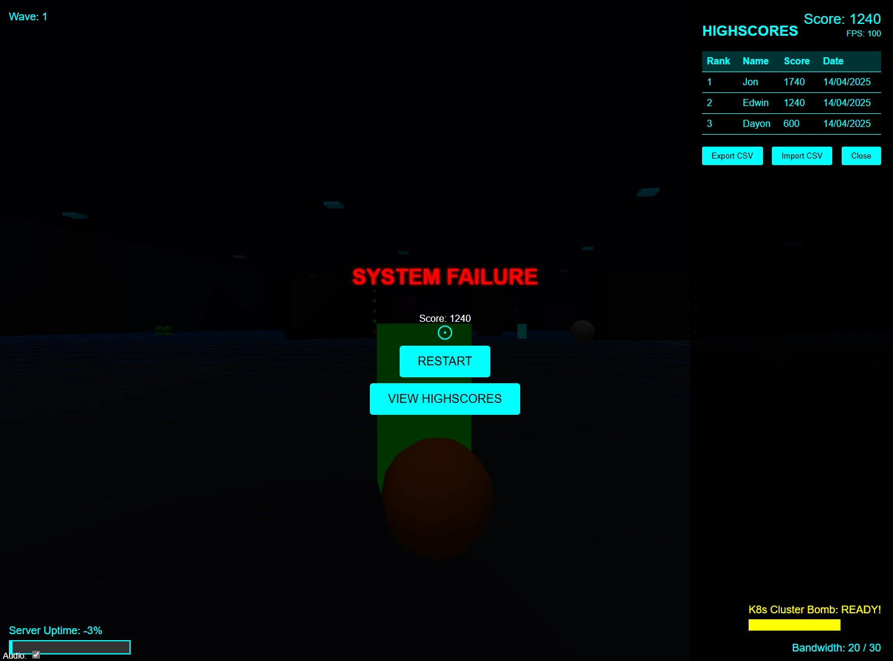

```markdown
# 🕹️ Adventures in DevOOPS pt.1: The Code Crusade


**A browser-based FPS where DevOps meets bug-squashing mayhem!** Battle software bugs, security exploits, and legacy systems in this neon-lit tech nightmare. Built with Three.js.

[](https://your-deployment-url.com) *(placeholder link)*

 *(Add actual screenshot path)*

## 🚀 Features

### Core Gameplay
- 🔫 **DevOps Arsenal**
  - CI/CD Railgun (primary)
  - Git Hook melee weapon
  - Kubernetes Cluster Bomb ultimate
- 🐛 **Enemy Types**
  - Buffer Overflow Beetles
  - SQL Injection Slugs
  - DDoS Dragon (boss)
- 🎮 **Movement**
  - Double-jump & cloud leap mechanics
  - Wall-running on server racks

### Tech World
- 🌐 **Procedural Environments**
  - Server rooms, cloud networks, code dungeons
  - Deadly data lakes & firewall puzzles
- 💾 **Power-Ups**
  - SSL Shield (invincibility)
  - Blockchain Health Packs
  - Auto-Scaling Ammo

### Social & Viral
- 🏆 **Leaderboards**
  - Global DevOps Rank system
  - Combo multipliers for style kills
- 🎭 **Customization**
  - Unlockable hats (Red Hat, AWS Cape)
  - Pet Terraform Owl companion
- 📸 **Shareable GIFs**
  - Auto-generated kill clips
  - Twitter integration for bragging

## 🕹️ How to Play

### Controls
| Action          | Key           |
|-----------------|---------------|
| Move            | WASD          |
| Jump            | Space         |
| Shoot           | Left Click    |
| Melee           | Right Click   |
| Ultimate        | Q             |
| Toggle Shield   | E             |

**Objective:** Survive waves of enemies while protecting the CI/CD pipeline!
   ```
## 🛠️ Installation

1. Clone repo:
   ```bash
   git clone https://github.com/yourusername/adventures-in-devoops.git
   ```
2. Install dependencies:
   ```bash
   npm install
   ```
3. Start local server:
   ```bash
   npm run dev
   ```
4. Open `http://localhost:8080` in browser

## Tech Stack
- 🚀 **Three.js** (WebGL rendering)
- 💥 **Cannon.js** (Physics engine)
- 🔊 **Howler.js** (Audio)
- 📦 **Webpack** (Bundling)

## 🤝 Contributing

Bug reports and PRs welcome! Help us squash these:
- [ ] New enemy types (OpenSSL Worms?)
- [ ] Multiplayer co-op mode
- [ ] Additional level themes

Follow our [contribution guidelines](CONTRIBUTING.md).

## 📜 License

MIT License - see [LICENSE.md](LICENSE.md) for details.

## 🙏 Acknowledgements

- Three.js community
- Inspired by DevOps war stories
- Coffee ☕️ (The real MVP)

---

**Ready to git commit some destruction?** 🔫🐞

[⬆️ Back to Top](#-adventures-in-devoops-pt1-the-code-crusade)
```
